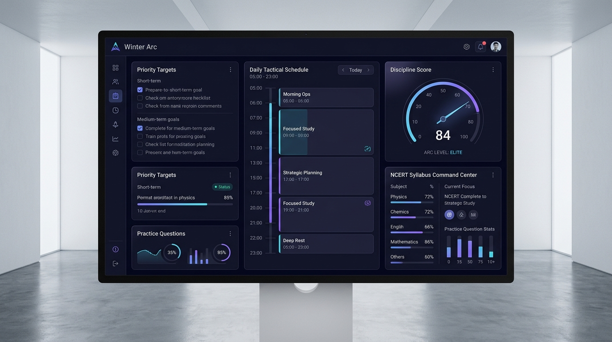
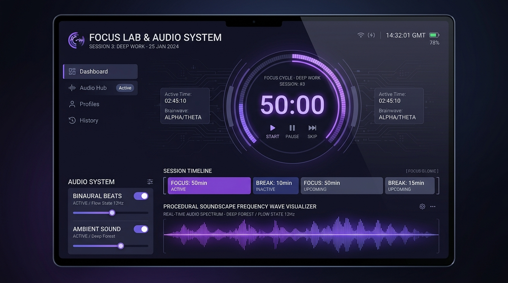

# WINTER ARC // DISCIPLINE SYSTEM & FOCUS LAB

> *"Do not measure motivation. Measure execution."*

A local-first tactical personal day planner, strategic discipline engine, CBSE academic mastery command center, and deep-work **Focus Lab** with procedural ambient audio synthesis. Built with a sterile **White Room** / Ayanokoji analytical interface and Sakuta-inspired dark violet/indigo atmospheric aesthetic.

---

## 📸 Interface Preview & Features


*Figure 1: Winter Arc Command Center — Daily Routine Timeline, NCERT Academic Progress, Non-Negotiables, and Mathematical Discipline Score.*

---


*Figure 2: Focus Lab — Precision Pomodoro Engine, Multi-Cycle Timeline, Procedural Web Audio Soundscapes, and Real-Time Frequency Visualizer.*

---

## ⚡ Core Capabilities & Architecture

### 1. 🛡️ Local-First & Zero-Surveillance Architecture
- **100% Offline Resilience**: All data (daily plans, tasks, objectives, NCERT academic syllabus status, focus sessions, pause events, and audio playlists) is stored locally in the browser via **IndexedDB**.
- **No Cloud Dependency / Zero Telemetry**: Operates completely hermetic without external authentication servers or cloud trackers.
- **Full Data Ownership**: 1-click JSON full export and import for seamless backup and cross-device migration.
- **PWA & Desktop App Ready**: Service Worker enabled with offline caching and standalone display mode.

---

### 2. 🎯 Tactical Dashboard (HOME)
- **Mathematical Discipline Score (0–100)**: Transparent calculation balancing task execution (35%), schedule adherence (20%), academic syllabus progress (20%), focus consistency (15%), and daily non-negotiable objectives (10%).
- **Day Type Intelligence**: Automatic classification for **School Days**, **Holidays/Sundays**, **Exam/Coaching Days**, and manual overrides with real-time study capacity calculations.
- **Timeline At-A-Glance**: Live current task highlight, upcoming milestone preview, and remaining day capacity.
- **Top 3 Non-Negotiable Directives**: Hard commitment tracker for daily priority targets.

---

### 3. ⏱️ Focus Lab — Deep Work & Pomodoro Engine (FOCUS LAB)
- **Universal Pomodoro Presets**:
  - `UNIVERSAL FOCUS`: 3-Hour high-output structure (50m Focus / 10m Break × 3 cycles)
  - `CLASSIC`: Traditional 25m Focus / 5m Break
  - `EXTENDED`: 50m Focus / 10m Break
  - `DEEP WORK`: 90m Focus / 15m Break
  - `CUSTOM BUILDER`: Construct arbitrary multi-block sequences with custom focus blocks, short breaks, and long breaks.
- **Throttling-Proof Background Accuracy**: Time calculation relies strictly on high-precision delta timestamps (`targetEndTimestamp - currentTimestamp`), preventing drift when tabs are backgrounded, minimized, or CPU-throttled.
- **Pauses vs. Healthy Breaks Tracking**: Distinguishes scheduled recovery breaks from unplanned interruptions. Logs pause timestamps, resume timestamps, duration, and optional distraction reason.
- **Objective Commitment & After-Session Debrief**: Prompts for intentional session objectives before starting, followed by completion status rating (Completed, Partial, Abandoned) and reflective debriefing.
- **Distraction-Free White Room HUD**: Fullscreen immersive mode (`F` or `Space` to toggle, `Esc` to exit) stripping all UI noise to leave only the timer, objective, and audio state.

---

### 4. 🎧 Audio Lab — Procedural Audio & Personal Library
- **Procedural Mathematical Soundscapes (Web Audio API)**: Zero-network, license-clean synthesizers that run entirely offline without copyrighted samples:
  - **40 Hz Gamma Binaural Beats**: Dual precision sine oscillators for neural synchronization.
  - **Low-Frequency Focus Drone**: Grounding resonant sub-bass drone for sustained attention.
  - **Nature Elements**: Procedural White/Pink filtered rain, heavy downpour, forest wind, ocean surge, and crackling fireplace.
  - **Color Noises**: Calibrated Brown noise, Pink noise, and White noise generators.
- **Transparent Open Licensing**: All built-in soundscapes are CC0 / mathematical algorithms with explicit licensing metadata.
- **Personal Audio Importer**: Import local audio files (`.mp3`, `.wav`, `.ogg`, `.m4a`, `.aac`, `.flac`) via the browser File API into IndexedDB. Files are never uploaded to any remote server.
- **Playlist & Player HUD**: Multi-playlist creation, reordering, shuffle, loop, seek, volume control, and dynamic canvas frequency visualizer.
- **Focus Auto-Sync**: Audio automatically engages when focus sessions start, pauses on breaks (optional), and ceases upon session conclusion.

---

### 5. 📚 NCERT Academic Command Center (ACADEMICS)
- **Built-in Class 9–12 Syllabus Database**: Complete chapter breakdowns across Physics, Chemistry, Mathematics, and Biology.
- **5-Stage Mastery Progression**:
  - `NOT_STARTED` ➔ `THEORY_READING` ➔ `QUESTION_PRACTICE` ➔ `PYQ_SOLVED` ➔ `MASTERED`
- **Cognitive Metrics**: Chapter difficulty ratings, concept density weighting, and revision buffer countdowns.
- **CBSE Board Exam Countdown**: High-precision countdown timers to official board exam schedules with subject-specific readiness gauges.
- **Instant Focus Link**: Launch tailored Deep Work blocks directly linked to any specific syllabus chapter.

---

### 6. 📊 Analytical Intelligence & Discipline Tracking (ANALYTICS)
- **Longitudinal Trendlines**: 7-day, 30-day, and 90-day trajectory graphs for discipline score, actual study hours, and schedule fidelity.
- **Focus Consistency Auditing**: Planned vs. actual focus hours, average uninterrupted block length, and pause frequency.
- **Failure Point Diagnostics**: Unplanned interruption patterns and subject time allocation heatmaps.

---

### 7. 🗓️ Planner, Calendar & Daily Review (PLAN / CALENDAR / REVIEW)
- **Dynamic Day Planner**: Drag-and-drop block reorganization, time budget allocation, and study vs. school balance analysis.
- **Milestone Calendar**: Unified timeline integrating CBSE exams, school tests, coaching tests, and personal goals.
- **After-Action Review (AAR)**: Nightly retrospective interface auditing task execution rate, failure reasons, and discipline grade.

---

## 🛠️ Technology Stack

| Layer | Technology |
|---|---|
| **Framework** | React 19 + TypeScript (Strict Mode) |
| **Build Tool** | Vite 6 |
| **Styling** | Tailwind CSS v4 (Obsidian & Violet White Room Palette) |
| **Local Database** | IndexedDB (Native schema v3 with zero ORM overhead) |
| **Audio Engine** | Web Audio API (Native `AudioContext`, `BiquadFilter`, `AnalyserNode`, `OscillatorNode`) |
| **Icons** | Lucide React |
| **PWA** | Vite PWA Plugin with offline Service Worker support |

---

## 🚀 Getting Started

### Prerequisites
- Node.js 18+ or 20+
- npm, yarn, or pnpm

### Installation

1. **Clone the repository**:
   ```bash
   git clone https://github.com/your-username/winter-arc-discipline.git
   cd winter-arc-discipline
   ```

2. **Install dependencies**:
   ```bash
   npm install
   ```

3. **Launch the development server**:
   ```bash
   npm run dev
   ```
   Open `http://localhost:3000` in your browser.

4. **Production Build**:
   ```bash
   npm run build
   ```

---

## ⌨️ Keyboard Shortcuts (Focus Lab)

| Shortcut | Action |
|---|---|
| `Space` | Start / Pause Timer |
| `F` | Toggle Distraction-Free Fullscreen Mode |
| `Esc` | Exit Fullscreen Mode |
| `S` | Skip to Next Block |
| `R` | Reset Current Session |
| `M` | Mute / Unmute Audio Lab |

---

## 📜 Philosophy

> "Motivation is transient; discipline is algorithmic. Build an environment where distraction is difficult and execution is inevitable."

Winter Arc is designed around strict minimalism: no gamified badges, no cartoon mascots, no unnecessary social feeds. Pure analytical clarity for relentless academic and personal mastery.
